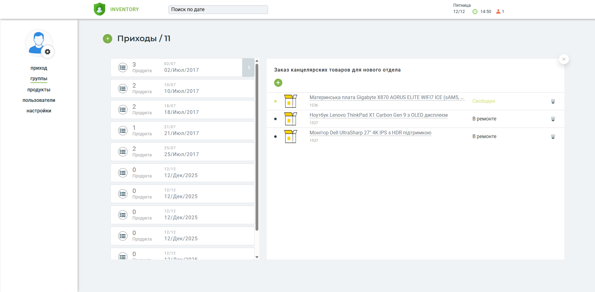
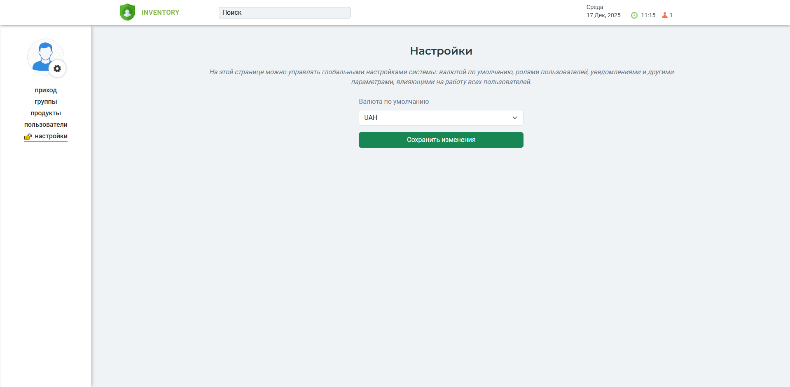
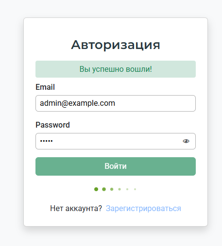
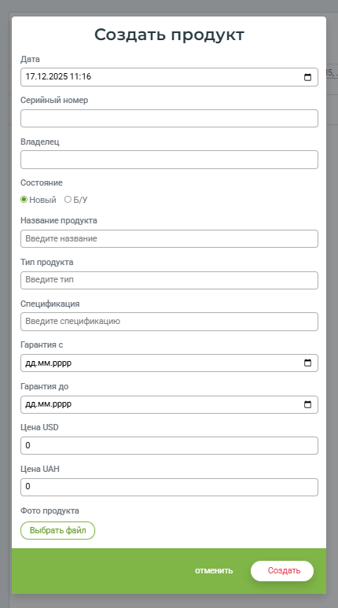

# Orders_Products

## Description
This project is a **test assignment** designed to demonstrate skills in both frontend and backend development. The main goal is to create a web application for managing **orders and products** with **real-time updates**, **search**, **filtering**, and **Socket.io integration** for displaying active sessions.

⚠️ The project is in a **test implementation state**. Some features (e.g., localization, themes, advanced admin panel, tests) can still be further developed, but the core functionality is fully working.

> 🔹 **Note:** I went beyond just the frontend and implemented the backend as well, because I enjoy having control over both sides and seeing the full process of the application.

---

## Technologies

### Backend:
- **Node.js** – JavaScript runtime environment for building server-side applications.  
- **Express** – Web framework for Node.js, used to handle routing, middleware, and server logic.  
- **MySQL2** – MySQL client for Node.js, used to interact with the database.  
- **Socket.io** – Library for real-time communication between server and clients, used here to display active user sessions.  
- **JSON Web Token (jsonwebtoken)** – Library for authentication, enabling secure token-based login and session management.  
- **Bcrypt** – Library for hashing passwords to securely store user credentials in the database.  
- **Multer** – Middleware for handling file uploads, used to save user profile photos and product images.  
- **Winston** – Logging library to record server events, errors, and general application activity.  
- **winston-daily-rotate-file** – Extension for Winston that rotates log files daily for better log management.  
- **Cors** – Middleware to enable Cross-Origin Resource Sharing, allowing frontend applications from different origins to communicate with the backend.  
- **Dotenv** – Loads environment variables from a `.env` file, useful for sensitive information like database credentials and secret keys.  
- **Nodemon** – Development tool that automatically restarts the server when code changes, improving development workflow.

### Frontend:
- **Vue 3** – JavaScript framework for building reactive user interfaces.  
- **Vue Router** – Official routing library for Vue, used to manage navigation between pages.  
- **Vuex** – State management library for Vue applications, used to store global application data.  
- **Bootstrap 5** – CSS framework for responsive design, grid layout, and prebuilt UI components.  
- **Socket.io-client** – Library to connect to the backend Socket.io server for real-time updates.  
- **Yup** – JavaScript schema validation library, used for validating forms.  
- **vue-virtual-scroll-grid** – Efficient rendering of large lists by dynamically loading only visible items, improving performance.  
- **Vite** – Fast build tool and development server for modern frontend projects.  
- **TypeScript** – Typed superset of JavaScript for safer code.

---

## Features

### Backend:
- User **registration**, **login**, and **photo update**  
- Password hashing and JWT authentication  
- **CRUD** for orders and products  
- Relations between products and orders (deleting an order deletes all related products and their photos)  
- File storage and deletion for user and product photos  
- **Active session counter** via Socket.io  
- Registration and login pages with **forms**, validation, responsiveness, and notifications  
- **Database caching** for faster updates when data changes  

### Frontend:

#### Sidebar Navigation:
- Navigate between **Orders**, **Products**, **Groups**, and others 
- Display user profile photo  

#### Top Bar:
- Real-time **clock and date**  
- Active session counter  
- Search functionality  

#### Orders Page:
- Search by order name  
- Create new orders  
- Expand to view the list of products in an order  
- Delete orders along with all their products  
- Display **dates in multiple formats**  
- Display total order amount in **two currencies**  
- Show the number of orders  

#### Products Page:
- Display all required product fields (name, type, warranty, price, etc.)  
- Filter by type and search by partial words  
- Delete individual products  
- Show the number of products  

#### **Settings Page / Access Control:**
- Accessible **only to users with the admin role**  
- **Managers or other roles** cannot access the Settings page  
- Role-based route guards in the frontend prevent unauthorized access  
- Backend also verifies roles when accessing sensitive endpoints
- **Admin can select the default currency** for display across the application  

#### Group Page:
- Sidebar list of orders with buttons to expand products in each order  
- Create products directly within an order  
- Create new orders  
- Product creation form allows setting all fields  

### Other Frontend Features:
- Forms with **validation**  
- **Responsive design**  
- **BEM-like styling**  
- **Animations and modal windows**  
- Efficient rendering of large lists using `vue-virtual-scroll-grid` (dynamic loading of 20–30 items)  

> **Note:** Data on the frontend is **cached using Vuex**, so repeated requests for the same data do not hit the server unnecessarily. This improves performance and reduces server load.  
> ⚠️ I am aware that this approach is not ideal for this project. While the implementation with CRUD and cache that updates periodically works fine, it is not suitable here. For **real-time updates** of products and orders, a Socket.io-based solution would be the correct approach. However, for demonstration purposes, this solution is sufficient.

---

## Future Improvements
- **Localization** and theme support  
- **Advanced admin panel** with access controls  
- **Unit tests** (using Jest)  
- **Style optimization** and closer alignment with design mockups  

---

### Screenshots

    

        
        
    

    

        
        
    

---